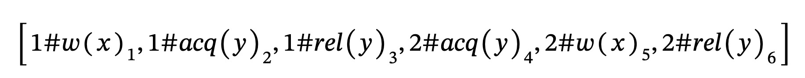
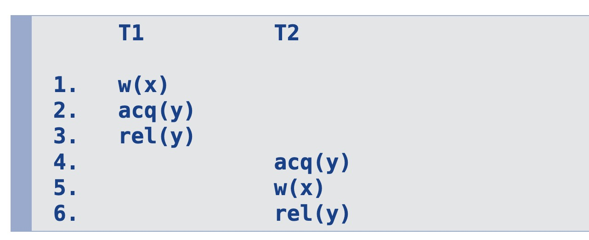

# as::dynamic-data-race-prediction

## when does a data race occur?

- if two conflicting event appear right next to each other in the trace (means both events happen at the same time)

## valid trace reordering

- program order must be maintained: The releative order of events for specific thread in P and P’ must remain the same
- lock semantic must be maintained: there must be a rel() between two acq()
- last writer must be maintained: Let r(x) be a read event in P’. Then, r(x) must have the same last writer in P’ as in P.

## complete

means that all valid reorderings that exhibit some race can be predicted. If incomplete, we refer to any not reported race as a false negative.

## sound

- means that races reported can be observed via some appropriate reordering of the trace. If unsound, we refer to wrongly a classified race as a false positive.
- if a dynamic data race prediction method is sound, then any race it detects is a real race that could happen in some execution of the program.

## happens-before

- incomplete: it might not identify all possible races

## lockset

- unsound: it

## j#e_i notation

- event e at trace position i in thread j

## 

## HB < Relation

Partial order that meets the following conditions:

1. program order

   - (its always j#e_i < j#f\_{i+n})
   - so an event in a thread always happens before the event that happens later in the thread at a higher position
   - states that events are ordered based on their trace position

2. critical section order
   - its always i#rel(x)\_k < j#acq(x)\_{k+n}
   - states that critical sections are ordered based on their trace position

- does not enforce last writer!

## Happens-Before data race check

- $e$ and $f$ are conflicting events
- $(e, f)$ is a HB data race pair if neither $e \lt f$ or $f \lt e$
- bc we are free to reorder the trace such that they are next to each other
- we may encounter false positives and false negatives

## State variables in FastTrack

- Th(i): vector clock of thread i
- R(x): vector clock for reads we have seen
- W(x): epoch of most recent write
- Rel(y): vector clock for most recent release on lock y

- R(x), W(x), Rel(y) are initialized to zero
- initially in Th(i) all time stamps are zero but of entry i which is one

## TSan

- ThreadSanitizer '-race'
- fasttrack with some optimizations
- dynamic race detection with llvm compiler
- go race detector is built on top of it
