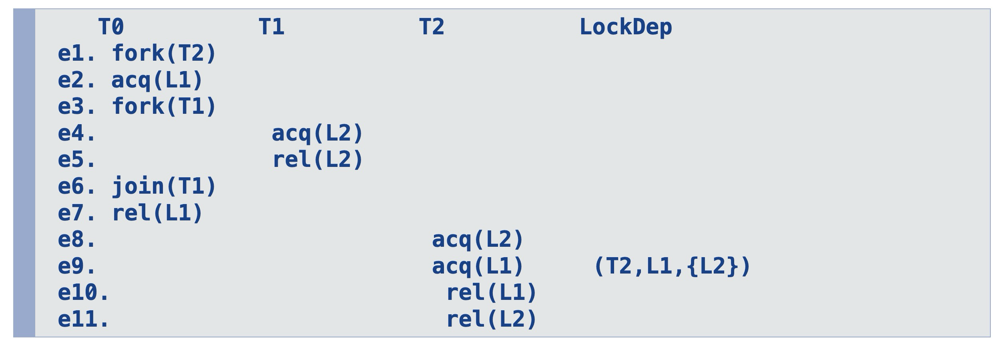
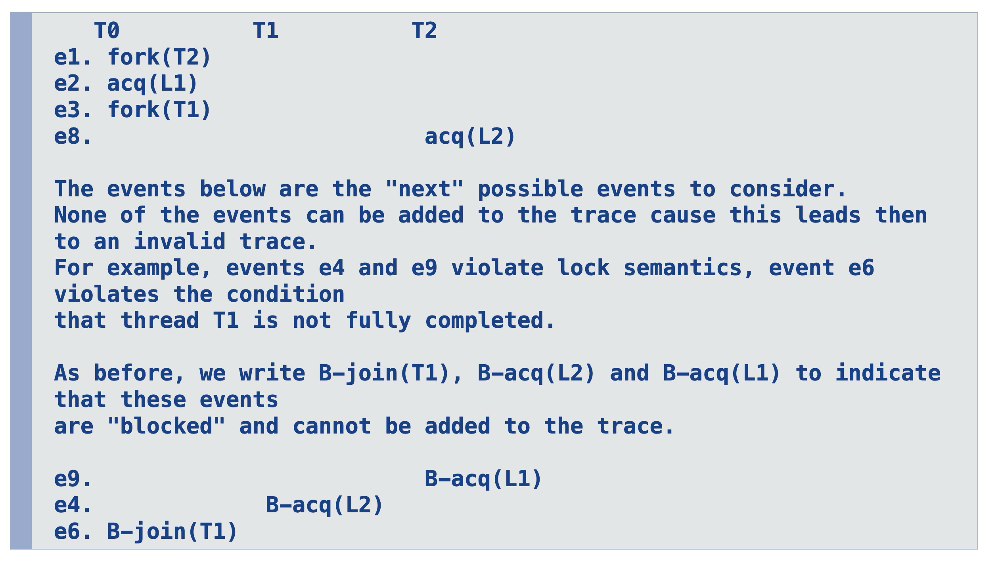

# as::dynamic-data-race-prediction

## when does a data race occur?

- if two conflicting event appear right next to each other in the trace (means both events happen at the same time)

## valid trace reordering

- program order must be maintained: The releative order of events for specific thread in P and P’ must remain the same
- lock semantic must be maintained: there must be a rel() between two acq()
- last writer must be maintained: Let r(x) be a read event in P’. Then, r(x) must have the same last writer in P’ as in P.

## complete

means that all valid reorderings that exhibit some race can be predicted. If incomplete, we refer to any not reported race as a false negative.

## sound

- means that races reported can be observed via some appropriate reordering of the trace. If unsound, we refer to wrongly a classified race as a false positive.
- if a dynamic data race prediction method is sound, then any race it detects is a real race that could happen in some execution of the program.

## happens-before

- incomplete: it might not identify all possible races
- unsound

## lockset

- unsound

## j#e_i notation

- event e at trace position i in thread j

## 

## HB < Relation

Partial order that meets the following conditions:

1. program order

   - (its always j#e_i < j#f\_{i+n})
   - so an event in a thread always happens before the event that happens later in the thread at a higher position
   - states that events are ordered based on their trace position

2. critical section order
   - its always i#rel(x)\_k < j#acq(x)\_{k+n}
   - states that critical sections are ordered based on their trace position

- does not enforce last writer!

## Happens-Before data race check

- $e$ and $f$ are conflicting events
- $(e, f)$ is a HB data race pair if neither $e \lt f$ or $f \lt e$
- bc we are free to reorder the trace such that they are next to each other
- we may encounter false positives and false negatives

## State variables in FastTrack

- Th(i): vector clock of thread i
- R(x): vector clock for reads we have seen
- W(x): epoch of most recent write
- Rel(y): vector clock for most recent release on lock y

- R(x), W(x), Rel(y) are initialized to zero
- initially in Th(i) all time stamps are zero but of entry i which is one

## TSan

- ThreadSanitizer '-race'
- fasttrack with some optimizations
- dynamic race detection with llvm compiler
- go race detector is built on top of it

## Lockset data race check

- if two conflicting events share the same lock y then they belong to two different critical sections
- so they cannot be in a data race since critical sections are mutually exclusive
- if the lockset of two conflicting events are disjoint then they are a data race pair

## CS(i#acq(y)\_k, i#rel(y)\_j)

- to denote the set of events that are part of the critical section

## LS(e)

the lockset of e consists of all y's where e appears (in y's critical section)

## why is lockset unsound

- ignores write-read dependency
- allows to reorder critical sections

## efficient methods for dynamic data race prediction

- underapproximate
  - considers only certain reorderings
  - e.g. HB
  - generally no false positive but false negatives!
- overapproximate
  - considers possibly too many reorderings
  - e.g. lockset
  - generally no false negatives but false positives

## resource deadlock

- a set of threads blocked
- each thread is waiting for a lock held by another thread in the set

## lock graph

- locks are nodes
- edge from lock x to lock y if the thread holds lock x and acquires lock y
- if there is a cycle then there is a potential deadlock

## guard locks

- are there to protect thread from deadlocks if there is a cyclic lock graph without it

## lock dependency

- D = (id, l, ls)
- id: thread
- l: welches lock will ich?
- ls: welche locks habe ich bereits?

## lock dependency state variables

- ls(t): the set of locks held by a thread t at a certain time
- Ds: the set of lock dependencies

## go style mutexes behavior

- they behave like semaphores, so a thread can release a lock that was acquired by a different thread

## deadlock prediction via lockgraph

- results in further false positives

## cycle check via lock dependencies

A deadlock is issued if there is a cyclic lock dependency chain D_1...D_n
where each D_i is from a distinct thread and:

- LD-1: {Ls_i} cap {Ls_j} = {} where i != j

  - locksets are disjoint e.g. {L1} cap {L2} = {}

- LD-2: l_i \in ls_i+1 for i=1,...,n-1

  - if lock is in the lockset of the next lock dependency of another thread e.g. L2 in {L2}

- LD-3: l_n \in ls_1
  - if the last lock is in the lockset of the first lock dependency e.g. L1 in {L1}

## warum liefert lock graph false positives

- es wird nicht zwischen versch. threads unterschieden
- guard locks

## wann liefern lock dependencies false positives

- lock dependencies können write read dependencies missachten
- man kann per reordering den trace dann nicht nachstellen da es sonst write read violatet

## wann liefern lock dependencies false negatives

- wegen cross thread critical section
- wenn mittendrin noch ein fork passiert

- es wird deadlock reported aber man kann per reordering

