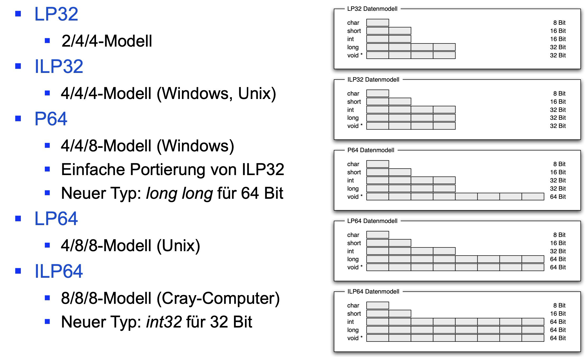

# es::c

## (\*(void(\*)())0xff)(); aufbrechen, 1. funktionszeiger deklarieren 2. auf korrekte adresse setzen 3. aufruf über funktionszeiger tätigen

```c
void (*fp)();
fp = (void(*)())0xff;
(*fp)();
```

## c datenmodell



## LP32

- 2/4/4
- char 8 bit
- shor 16 bit
- int 16 bit
- long 32 bit
- void \* 32 bit

## welches datenmodell benutzt 32 bit linux

- ILP32

## welches datenmodell benutzt 32 bit windows

- ILP32

## welches datenmodell benutzt 64 bit windows

- P64

## welches datenmodell benutzt 64 bit linux

- LP64

## welche pc's benutzen big endian

- motorola 68000
- sparc
- powerpc
- ibm
- sun

## welche pc's benutzen little endian

- intel x86
- vax
- dec alpha
