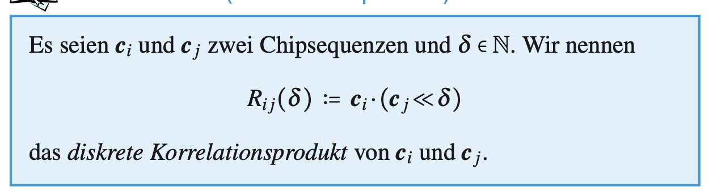
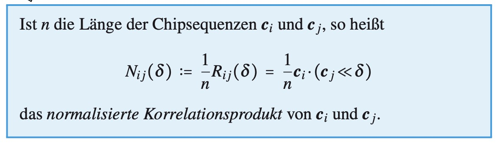
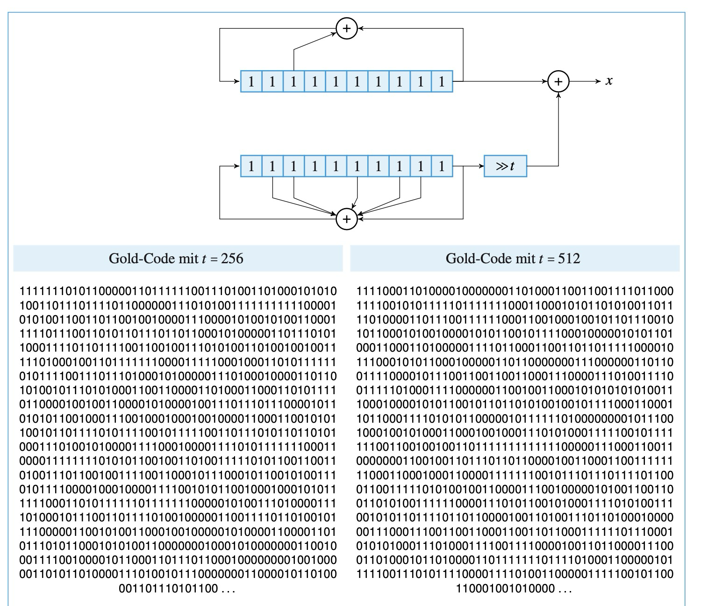

# es::cdma

## was ist cdma?

- code division multiple access
- ermöglicht satelliten gleichzeitig auf einer einzigen frequenz datenpakete zu senden
- einzelne bits werden mit chipsequenzen dargestellt
- Ob eine 1 oder eine −1 codiert wird, hängt davon ab, ob die Chipse- quenz unverändert oder invertiert erscheint.
- einzelsignale lassen sich aus dem summensignal rekonstruieren
- jeder sender hat seine chipsequenz die es benutzt um bits zu codieren
- entscheidend: zwei beliebige chipsequenzen sind orthogonal zueinander (skalarprodukt gleich 0)

## korrellationsprodukt

## normalisiertes korrelationsprodukt

## bit

- falls der wert aus der nachricht kommt

## chip

- falls der wert aus einer chipsequenz kommt
- 1 wird als + und -1 als - dargestellt

## bitsequenzen

- 1010 wird als (1, -1, 1, -1) interpretiert
- 0 als -1

## spreizcodes

- ovsf-code

## OVSF-code

- orthogonaler code (codewörter alle paarweise orthogonal zueinander)

- baumdarstellung:
  - 1. wurzel links (repräsentiert spreizfaktor 1, besteht aus dem codewort '+' also dem vektor(1))
  - 2. zum erweitern werden 2 zweige gebildet
    - codewortlänge wird verdoppelt
    - oberes codewort entsteht durch 2x wiederholung des vatercodeworts
    - unteres durch vatercodewort und invertierung des vatercodewortes drangehängt

## formel für bit der nachricht

- $s$ überlagertes sendesignal
- $c_i$ chipsequenz des i'ten senders
- $n$ länge chipsequenz

$$b_j = \frac{c_i \cdot s}{n}$$

## normalisiertes korrelationsprodukt

- wir abstrahieren die länge

## autokorellation

- korrelationsprodukt einer chipsequenz mit sich selbst

## was wird für das asynchrone cdma zusätzlich benötigt?

- das normalisierte autokorrelationsprodukt ergibt bei $\delta = 0$ 1 und ansonsten immer 0
- das normalisierte kreuzkorrelationsprodukt ergibt immer 0

## MLS

- Folgen maximaler Länge
- Zufallsfolgen mit einer maximalen Periodenlänge

## gold code

- 2 Mutterfolgen (1, 1, 1, 1, ...) erzeugen viele Gold Codes mit dem Parameter t

- Eignen sich für CDMA

## kasami folgen

- Mutterfolgen werden durch schieberegister unterschiedlicher länge erzeugt

## was für eine periodenlänge haben zufallsfolgen, die durch schieberegister mit n registerstufen erzeugt wurden

- $n$ ist die anzahl an registerstufen

- Periode/länge = $2^{n} - 1$

## wieviele registerstufen benutzt gps

- 1023 = 2^10 - 1

## wie groß ist der peak, den ein satellit im empfänger erzeugt?

- die länge der chipsequenz (also bei gps z.b. 1023)

## Können zwei Gold-Folgen orthogonal zueinander sein? Begründen Sie Ihre Antwort.

- Nein, da sie von mls registern erzeugt werden (haben eine länge von 2^n - 1 wobei n die registerstufen sind)
- daher ungerade, daher kann keine 0 ergeben
