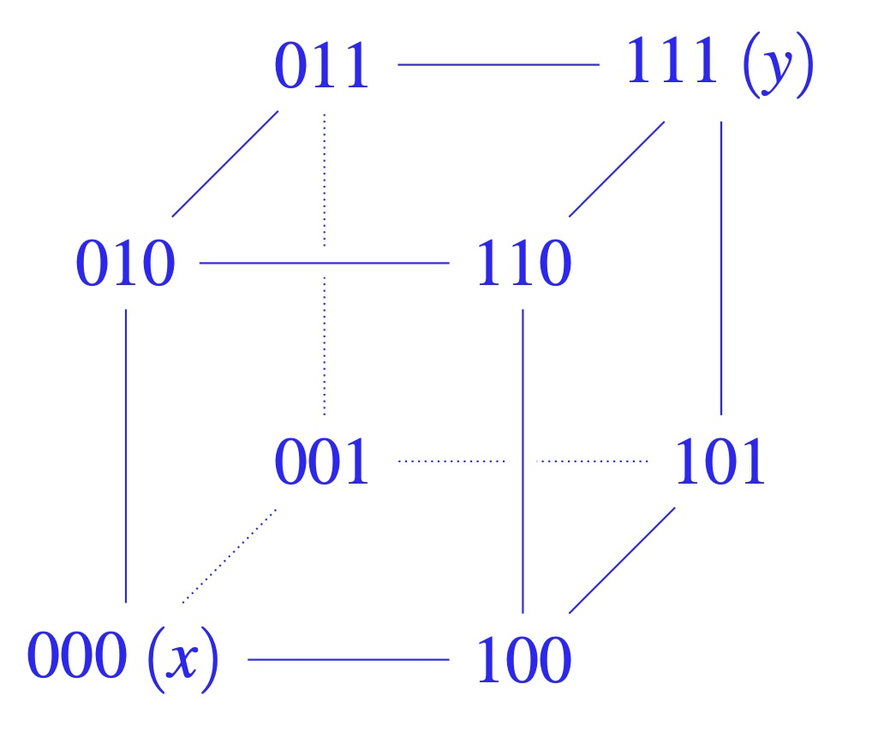

# es::crc

## was ist ein code?

- eine menge von codewörtern

## was bedeutet zyklisch?

- das verschieben eines codewortes, führt wieder zu einem codewort (verschieben der bits nach links oder rechts)

## für was steht crc?

- cyclic redundancy check

## merkmale crc

- koeffizienten des polynoms, sind symbole des codewortes
- codes werden von generatorpolynomen erzeugt

## hamming gewicht

- gibt an wie viele symbole von 0 verschieden sind
- $\omega(v)$

## hamming distanz

- die anzahl an positionen, an denen die symbole zweier codewörter eines codes verschieden sind
- $\Delta(v_1, v_2)$

## code distanz

- minimale hamming distanz
- $\min\{{\Delta(v_1, v_2) \mid v_1, v_2 \in C, v_1 \neq v_2}\}$

## hamming kugel

- eine kugel mit radius $r$ um ein codewort $x$
- menge aller bitfolgen die sich von $x$ um höchstens $r$ positionen unterscheiden
- $K_r(v) := \{ w \in C \mid \Delta(v,w) \leq r \}$

## was gilt für fehlererkennung bzw. korrigierung

- C ist r-fehlerkennend wenn die code distanz größer als r ist

- C ist r-fehlerkorrigierend wenn die code distanz größer als 2r ist

- C kann bis zu $\Delta C - 1$ fehler erkennen

- C kann bis zu $\lfloor\frac{\Delta C - 1}  {2}\rfloor$ fehler korrigieren

## eigenschaften generierter code

- 0.. ist immer ein codewort (ist ein vielfaches vom generatorpolynom duch multiplikation mit 0)
- man kann das generatorpolynom ablesen: codewort als binärzahl: die kleinste zahl ungleich 0, das sind die koeffizienten des gp
- verschieben von koeffizienten des gp führen wieder zu einem codewort man darf die länge des codewortes aber nicht überschreiten

## wann erzeugt ein generatorpolynom einen zyklischen code?

- wenn: $g(x)$ teilt $x^{n} + 1$ ohne rest

## crc algorithmus

- gegeben:
  - generatorpolynom $g(x)$ mit $\deg g(x) = r$
  - nachrichtenpolynom $u(x)$ mit $\deg u(x) \lt n-r$
- gesucht:
  - codewortpolynom $v(x)$ mit $\deg v(x) \lt n$

1. multipliziere $u(x)$ mit $x^r$
2. dividiere $x^ru(x)$ durch $g(x)$
3. berechne die summe aus dem divisionsrest und $x^ru(x)$

## polynome die zyklische codes der länge 7 generieren

## Angenommen, die Codewortlänge sei n = 64. Wie könnte man entscheiden, ohne die Codewörter explizit auszurechnen, ob der CRC-Code dieser Länge ein zyklischer Co- de ist? Beschreiben Sie den Lösungsweg.

Es muss lediglich getestet werden, ob das Polynom x^64 + 1 durch das Generatorpolynom ohne Rest teilbar ist. Wenn ja, so ist der Code zyklisch, wenn nein, so ist er nicht zyklisch.

## hamming würfel zeichnen

## Das Generatorpolynom x + 1 erzeugt einen bekannten Code, der in der Praxis häufig zum Einsatz kommt. Um welchen Code handelt es sich?

- paritätscode

## mit welchem generatorpolynom kann man den paritätscode erzeugen?

g(x) = x + 1
