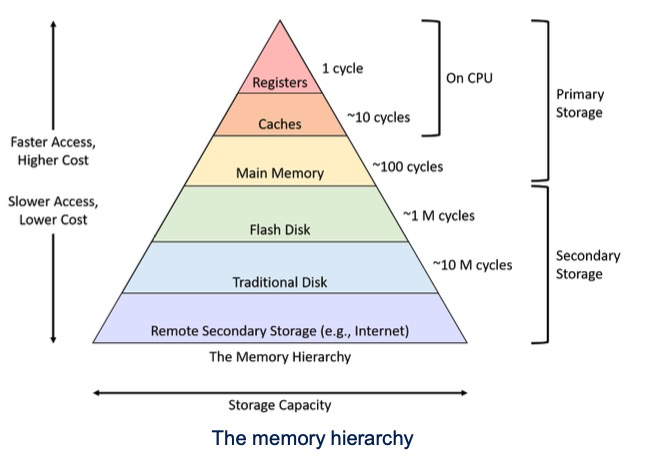

# ra::assembly

## risc vs cisc

- risc: reduced instruction set computer, also called load store architecture
- smaller number of instructions, memory referencing only allowed by load and store instructions
- cisc: complex instruction set computer

## why load store architecture

- memory access is expensive, have large and unpredictable latencies

## stack pointer

- special purpose register
- holds the address of the top of the stack (most recenlty added element)
- push: decrements (bc stack often grows downwards) to point to new top of the stack
- pop: incremented when data is removed to point to the new top of the stack

## STUR X10, [SP, #16]

- save x10's value on the position of the stack pointer (sp) + 16 offset

## pseudo instructions

- indicated by an =
- not an actualy machine instruction but it's for assembly and will figure it out, so the code is nicer

## exclusive mode

- only one thread can access the resource
- atomic instruction meaning the operation is guaranteed to complete without interruption

## register details

- 31 \* 64 bit registers R0 to R30
- X0-X30 full 64 bit
- W0 - W30 32 bit (zero extend the result up to 64 bit)

## memory hierarchy



## ISA Design Principles

- Smaller is faster (memory hierarchy)
- regularity enables performance (instruction scheme)
- make the common case fast (small constants, immediate operands)
- good design demands good compromises (multiple instruction formats, keep instruction format as simple as possible, tradeoff between simplicity, performance, and functionality)

## Core difference LDR and LDUR

- LDR

  - LDR Xt, [Xn, #pimm]
  - uses positive immediate (so range of #pimm is 0..32760 / 2^15 - 8)
  - needs to be aligned
  - encoded in the imm12 field

- LDUR
  - LDUR Xt, [Xn, #simm]
  - signed so range of #simm is -256..255 (2^8 - 1)
  - no alignment

## What is AND useful for?

- Useful to mask bits in a word
- select some bits, clear others to 0

## What is ORR useful for?

- set some bits to 1, leave others unchanged

## Condition flags

- N (negative): set to 1 if the result of the last flag setting operation was negative
- Z (zero): set to 1 if the result was zero
- C (carry): set to 1 if the result resulted in a carry condition (carryout of the most significant bit on unsigned numbers) e.g. 1111 + 0001 = 0000
- V (overflow): set to 1 if instruction resulted in an overflow condition, e.g. if the sum of signed numbers with the sign bit off result in a signed number with the sign bit on (0100 + 0100 = 1000)

## leaf vs nonleaf

- leaf: procedure just return
- nonleaf: procedure that calls other procedures

## .global main

- directive that makes sure main is accessible globally
- other modules can reach the main symbol

## .data

- directive to declare a section of memory
- any variable declared after .data will be allocated in memory and initialized
- distinct from .text or .bss

## .text

- directive to declare code section

## .quad

- used to define a quad word (64 bit / 8 byte)

```arm
.data
variable_name: .quad value
```

- e.g. A: .quad 2, 4, 6, 8, 10, 12, 14, 16, 18, 20
  - declares an array (with 10 items) of quad values

## arm code

.global main

## how to allocate 64 bytes on the stack and push FP and LR

```arm
stp x29, x30, [sp, #-0x40]!
```

then save original values of the registers when using it in a subroutine like so:

```arm
str x19, [sp, #16] //
str x20, [sp, #24] // x19 - x23 will be used in this subroutine ->
str x21, [sp, #32] // their original values must be saved to stack
str x22, [sp, #40] //
str x23, [sp, #48]
```

## frame pointer

- X29
- used to locate the base address of the frame

## link register

- X30
- store return address
- e.g. when using bl, the address of the next instruction is stored there
