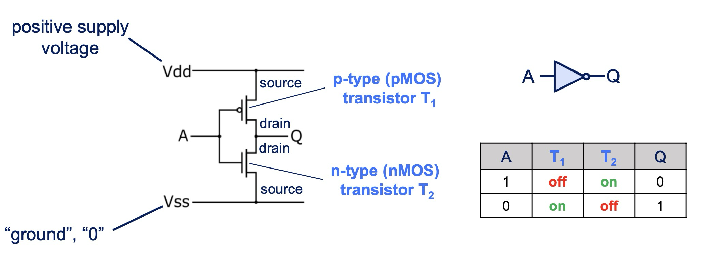
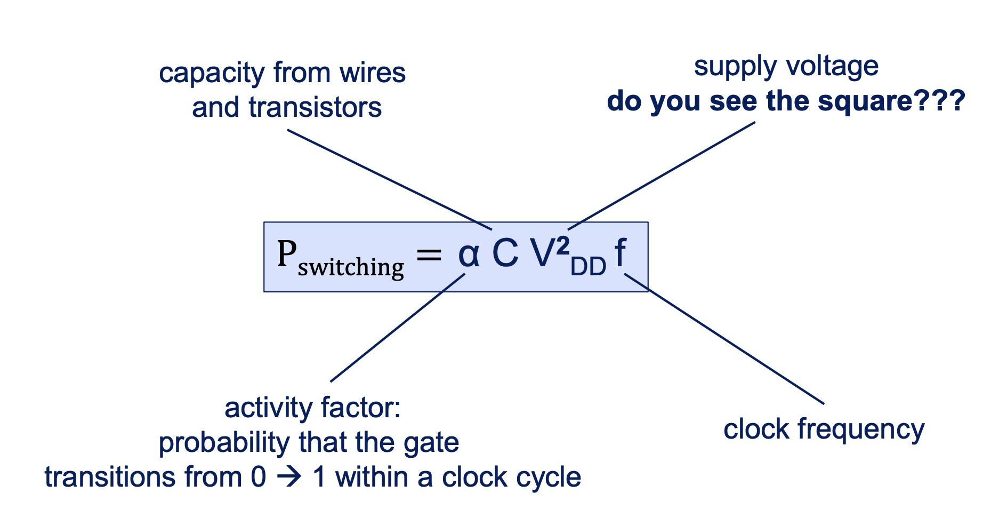

# ra::basics

## fet

- field effect transistor
- operates by magnetic field

## mosfet

- metal-oxide-semiconductor field effect transistor
- a type of fet transistor
- low power consumption
- high input impedance
- source: where the current enters
- drain: where the current exits
- gate: controls whether the current can flow from source to drain
- body (substrate): provides the substrate the parts sit on
- if current flows to the gate, it creates an electric field, so it can create a pathway from the source to the drain if the voltage is high enough

## nmos

- uses electrons to conduct current
- gate needs to be positive to open channel
- "needs a push to open"
- channel n-type material (doped with more negative charges, n-dotiert)
- body uses p-type material (has holes)

## pmos

- uses holes (effectively positive charges) to conduct current
- gate needs to be negative
- "needs a pull to open"
- channel uses p-type material (has holes, p-dotiert)
- body uses n-type material

## nmos icon

## pmos icon

## cmos

- complementary metal-oxide-semiconductor
- a fabrication process
- combines p-type and n-type mosfets
- generally uses a pull up network on the top consisting of pmos which is good at passing 1 (parallel)
- uses a pull down network on the bottom consisting of nmos which is good at passing 0 (serial)

## inverter (not-)gate

## 

- three-input nor gate

## 

- and gate

## 

- nand gate

## power dissipation

## How to measure progress in CMOS technology?

- LMC
- Transistor Logic density (transistors/mm^2)
- Memory density (bits/mm^2)
- Connections between logic and main memory (interconnects/mm^2)

## Power consumed in cmos

## what is the difference between legv8 and armv8

- armv8
  - aarch64 which means 64 bit data and addressing
  - more extensive operations for special use cases
- legv8
  - simplified for educational purposes,
  - 32 bit operations

## moore's law

- the number of transistors on a microchip doubles roughly every two years

## memory wall

- there is a gap between cpu and memory speeds
- CPUs have far outpaced the advancements in memory access speeds
- This waiting time creates a bottleneck that limits the overall performance of the system, especially in applications that require frequent access to large datasets or intensive computation

## what is currently limiting the further increase of processor frequency

- parallelism
- power consumption
- Transistor Switching Speed

## great ideas in computer architecture

- design for moore's law
- use abstraction to simplify design
- make the common case fast
- performance via parallelism
- performance via pipelining
- performance via prediction
- hierarchy of e.g. memory
- dependability via redundancy

## What killed Dennard scaling?

- leakage currents

## What are the 5 key components of a processor?

- datapath
- control
- (cache) memory
- input
- output
