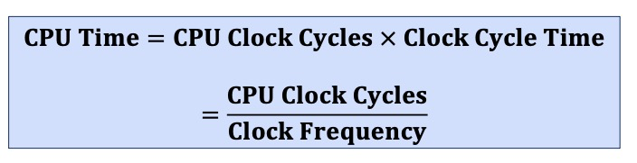
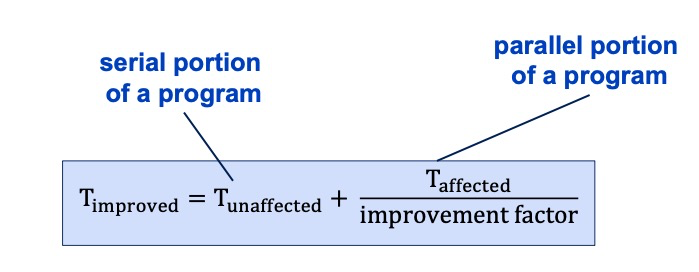
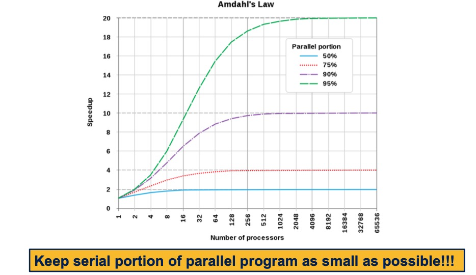

# ra::performance

## what is performance?

- the amount of useful work accomplished by a computer taking into account the time and resources used
- The amount of instructions handled
  by an (ARMv8) microprocessor taking into
  account the time and resources used (measured in IPC, instructions per cycle)

## performance engineering

- multiple methodologies
  - benchmarking
  - performance equation
  - amdahl's law

## benchmarking

- hardware: executing identical programs on different on a FPU (floating point unit), GPU, memory subsystem, ...
- software: executing e.g. a dbms on identical hardware

## benchmarking: basic principles

- relevance
- representativeness
- equity
- repeatability
- cost-effectiveness
- scalability
- transparency

## benchmarking: key metrics

- response time (latency): how long it takes to do a task (one instruction, ...)
- troughput: total work done per unit time (e.g. ipc)
- how response time and troughput are affected by replacing a processor core, adding more processor core?

## synchronous digital logic paradigm

- Operation of most digital hardware governed by a
  constant-rate clock
- clock period
- clock frequency

## cpu time of a workload

## how can cpu performance be improved?

- reducing number of clock cycles
- increasing clock frequency
- tradeoff: increasing clock frequency may also increase cycle count
  because instructions may then require more cycles to complete

## performance equation

- cpu time = cpu clock cycles x clock cycle time

- cpu clock cycles = instruction count x cycle per instruction (avg cpi)

- cpu time = instruction count x cpi x clock cycle time

## amdahl's law

- it's a pitfall to improve just one part of a system and expecting a proportional improvement in overall performance
- parallel programming:

## amdahl's law formula

- S is the speedup
- p is the parallel part of a program
- 1-p the serial part
- s is speedup of parallel part of program
- S is the overall speedup

S = 1 / (1-p + (p/s))
