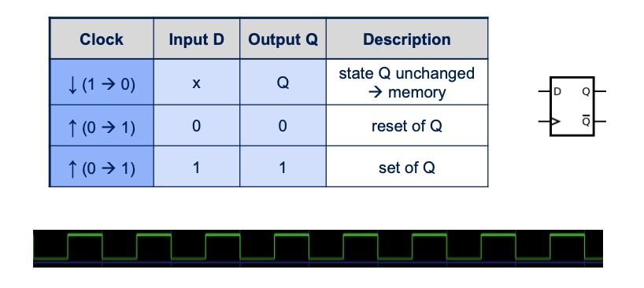
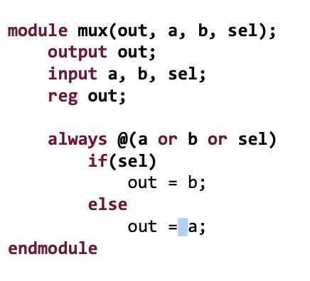
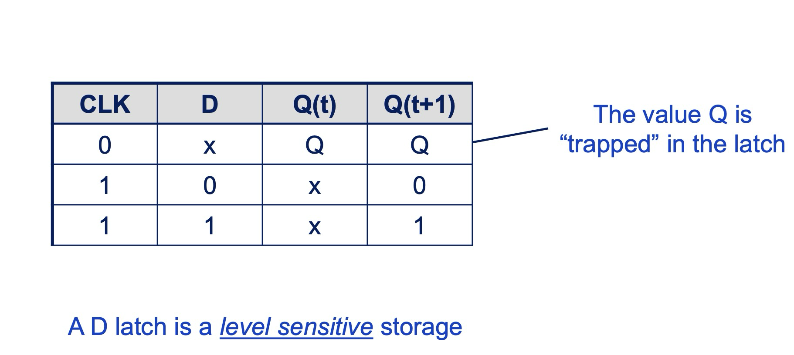

# ra::verilog

## verilog 95, mux.v

```v
module mux(out, a, b, sel);
    output wire out;
    input wire a, b, sel;

    // module body

endmodule
```

## verilog signal states

- 0: logic zero
- 1: logic one
- x: connected to 0 or 1 but uninitialized value / unknown
- z: high impedance, floating, undriven or not connected to 0 or 1

## verilog 2001, mux.v

```v
module mux(output wire out,
           input wire a,
           input wire b,
           input wire sel);

    // module body

endmodule
```

## Verilog-95 code using gate-level primitives

```v
module mux(out, a, b, sel);
    output out;
    input a, b, sel;

    and g1(out1, a, nsel),
        g2(out2, b, sel);
    or  g3(out, out1, out2);
    not g4(nsel, sel);
endmodule
```

## Verilog 'always'

An always block is a piece of code in Verilog that runs whenever certain signals change. It's used to describe how parts of a digital circuit should behave.

e.g.

```v
always @(*) begin
    sum = a + b; // Runs whenever 'a' or 'b' changes
end
```

'light switch'

or

```v
always @(a or b or sel)
    if(sel)
        out = b;
    else
        out = a;
```

- Sensitivity list contains signals whose change triggers the execution of the block: reactive programming paradigm

## Verilog-95 code using a continuous assignment

```v
assign out = sel ? b : a;
```

- any change of a or b causes reevaluation of sel
- out needs to be wire

## structural vs behavioral model

- structural:

  - Specifies exactly how components (modules, gates) are connected using wires and registers

  - ```v
      module adder(
        input wire [3:0] A, B,
        output wire [3:0] S
    );
        wire [3:0] C_out;
        full_adder FA0(A[0], B[0], 1'b0, S[0], C_out[0]);
        full_adder FA1(A[1], B[1], C_out[0], S[1], C_out[1]);
        full_adder FA2(A[2], B[2], C_out[1], S[2], C_out[2]);
        full_adder FA3(A[3], B[3], C_out[2], S[3], C_out[3]);
    endmodule
    ```

- behavioral:

  - uses always or initial blocks to define how signals or variables change over time

  - ```v
      module counter(
        input wire clk, reset,
        output reg [3:0] count
    );
        always @(posedge clk or posedge reset) begin
            if (reset) begin
                count <= 4'b0000;
            end else begin
                count <= count + 1;
            end
        end
    endmodule
    ```

## what is verilog used for?

- simulation
- (synthesis)

## d-flipflop

- delays the change of its output signal until the next rising edge of a clock timing input
- 

## DFF module in verilog

```v
module DFF( input clk, input [3:0] d, output reg [3:0] q );
    always @ (posedge clk) // triggers the block on the positive
                           // rising edge of the clock signal
    begin
        q <= d;
    end
endmodule
```

## multiplexer module in verilog



## when should we use nonblocking assignment?

- use blocking assignment (=) in combinational logic
- use nonblocking (<=) in sequential logic (when @always(posedge clk) or smth like that)

## how to map types of verilog to systemverilog

wire / reg -> logic

## combinational vs sequential circuits

- combinational:

  - have no memory
  - depend only on current input values to produce output
  - don't have clock input bc they don't require trigger

- sequential:
  - have memory
  - depend on both current inputs and previously stored state

## contamination delay

- minimum delay
- fastest possible signal propagation
- the time between the input change and the output change

## propagation delay

- maximum delay
- time between the input change and when the output reaches its final stable value

## synchronous

- clock is used

## asynchronous

- no global clock
- event driven

## D Latch



## $t_{ccq}$ / $t_{pcq}$

clock-to-q delay (contamination/propagation) at flip-flop

## $t_{cd}$ / $t_{pd}$

combinational logic delay (contamination/propagation)

## $t_{setup}$

time that flip-flop inputs must be stable before next clock edge

## $t_{hold}$

time that flip-flop inputs must be stable after a clock edge

## $T_c$

clock period
